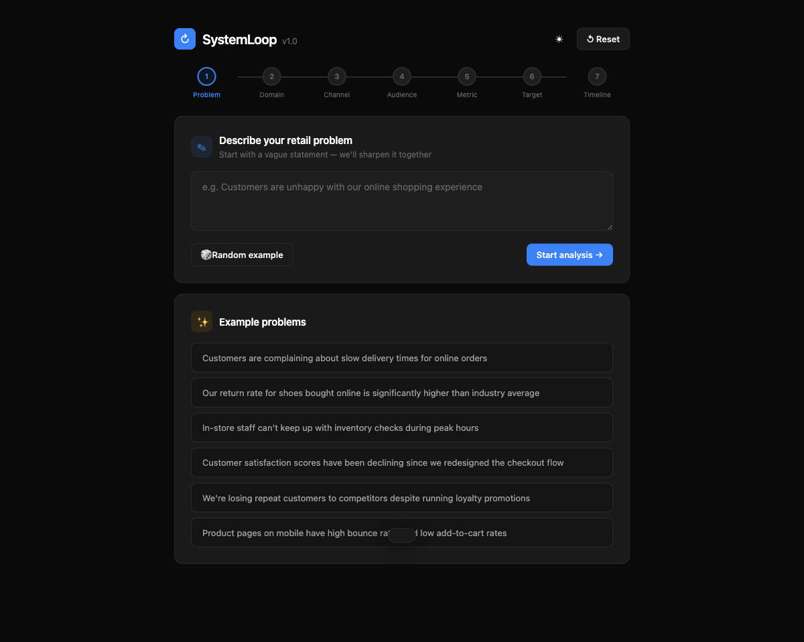
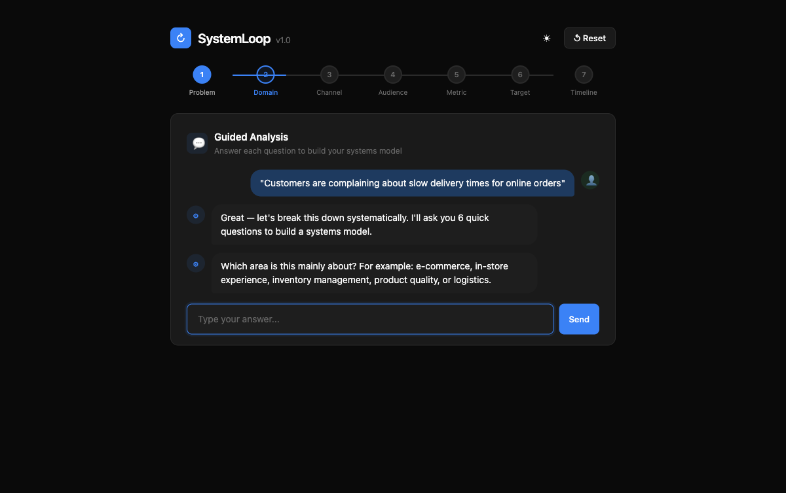

# SystemLoop

**Systems Thinking Problem Definer** — an interactive web app that guides users through structured problem definition using causal loop diagrams, built for fashion retail contexts like Charles & Keith.

[](https://alfredang.github.io/systemloop/)
[](#)
[](LICENSE)

---

## Screenshots

### Problem Input


### Guided Chat Analysis


### Results — Causal Loops & Problem Statement


---

## Features

- **Guided Question Flow** — Chat-style UI walks users through 6 structured questions one at a time
- **Reinforcing Loop (R)** — Auto-generated self-amplifying causal loop showing how the problem feeds itself
- **Balancing Loop (B)** — Auto-generated corrective causal loop showing how intervention stabilizes the system
- **Structured Problem Statement** — Stakeholder-ready output combining all inputs into a clear, actionable statement
- **Dark / Light Mode** — Toggle with theme persistence
- **Copy to Clipboard** — One-click copy of the final problem statement
- **Export PDF** — Print-optimized layout for sharing
- **Example Problems** — Pre-loaded retail scenarios for quick exploration
- **Random Problem Generator** — Instant starter prompts
- **Progress Indicator** — 7-step visual tracker
- **Responsive Design** — Works on desktop and mobile
- **Zero Dependencies** — Pure HTML, CSS, and JavaScript in a single file

## How It Works

1. **Describe a vague retail problem** (or pick an example)
2. **Answer 6 guided questions**: Domain, Channel, Audience, Current Metric, Target, Timeframe
3. **View auto-generated results**:
   - Reinforcing Loop (R) — the vicious cycle
   - Balancing Loop (B) — the corrective intervention
   - Structured problem statement ready for stakeholders

## Tech Stack

| Layer | Technology |
|-------|-----------|
| Markup | HTML5 |
| Styling | CSS3 (custom properties, animations, dark mode) |
| Logic | Vanilla JavaScript (ES6+) |
| Hosting | GitHub Pages |

No frameworks. No build step. No backend. Just open `index.html`.

## Getting Started

```bash
# Clone the repo
git clone https://github.com/alfredang/systemloop.git

# Open in browser
open systemloop/index.html
```

Or visit the [live demo](https://alfredang.github.io/systemloop/).

## Context

This tool applies **systems thinking** methodology to retail problem definition. Instead of jumping to solutions, it helps users:

- Map the **reinforcing loops** that make problems self-sustaining
- Identify **balancing loops** that represent corrective interventions
- Articulate problems in a **structured, measurable format**

Designed with fashion retail use cases (e.g., Charles & Keith) in mind, but applicable to any domain.

## License

MIT
